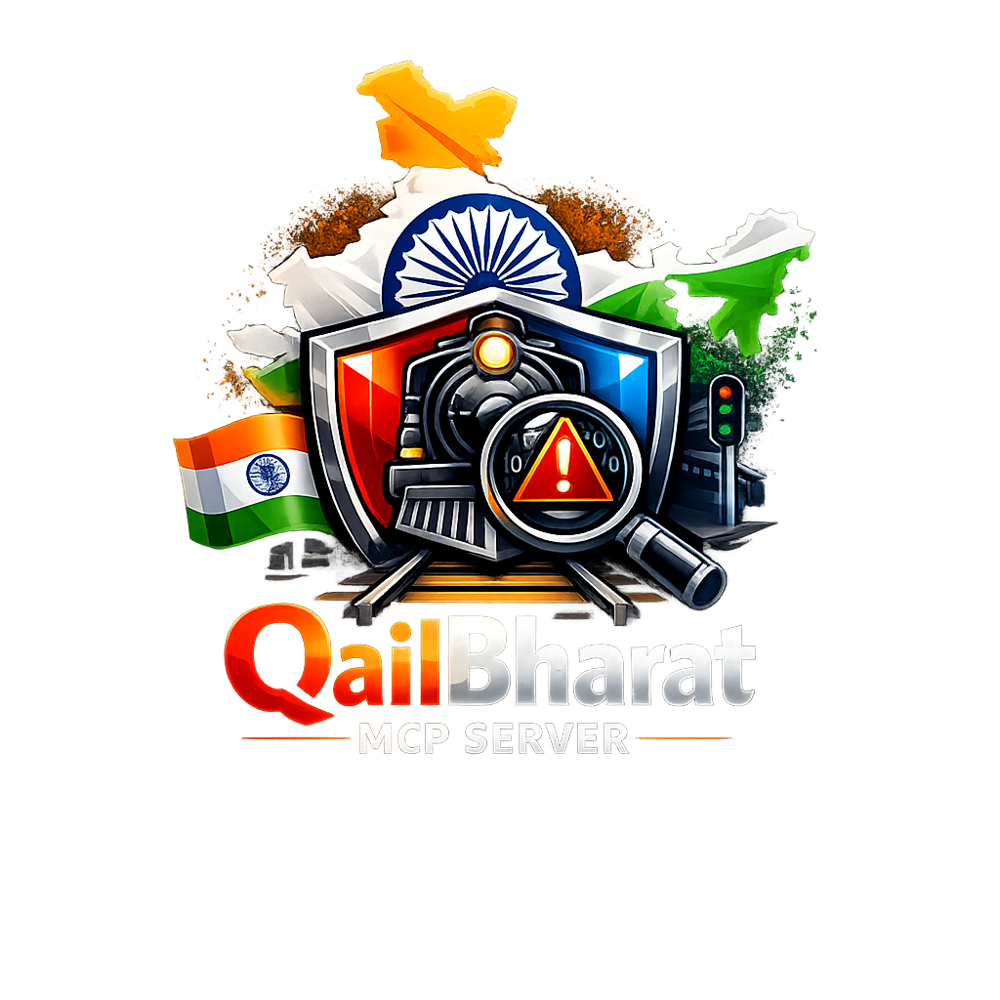

<p align="center">
  
</p>

<h1 align="center">RailBharat MCP Server</h1>

<p align="center">
  <strong>Unified Indian Railways Intelligence Platform via MCP</strong>
</p>

<p align="center">
  
  = 20" />
  
  
</p>

---

A **Model Context Protocol (MCP) server** that brings the entire Indian Railways ecosystem to AI assistants. Ask about train status, PNR bookings, find trains, explore stations, and navigate India's 68,000+ km rail network — all conversationally.

## Features

| Category | Tools | What You Can Do |
|----------|-------|-----------------|
| 🚂 **Live Tracking** | 3 | Real-time train position, delay status, ETA |
| 🎫 **PNR & Booking** | 2 | PNR status, seat availability |
| 🔍 **Train Search** | 2 | Find trains between stations, train details |
| 🏗️ **Station Intel** | 3 | Station info, board, fuzzy search |
| 🗺️ **Route & Schedule** | 2 | Full route with stops, fare enquiry |
| 📊 **Historical** | 2 | Punctuality stats, busiest routes |
| 📍 **Geospatial** | 2 | Nearby stations, route map geometry |

## Data Sources

All data sources are **optional** — the server works with whatever is configured and tells you how to enable more features.

| Source | Key Required | What It Enables |
|--------|-------------|-----------------|
| **IRCTC API (RapidAPI)** | Yes | PNR, live status, schedule, trains, seats, fares |
| **Indian Rail API** | Yes | Alternative source for live status and schedules |
| **OpenStreetMap Overpass** | No (free) | Nearby stations, station coordinates, route geometry |
| **data.gov.in** | No (optional) | Historical statistics, punctuality data |

## Monorepo Structure

```
├── packages/
│   ├── railbharat-server/          # MCP server (npm package)
│   └── railbharat-vscode-extension/ # VS Code extension (VSIX)
├── .github/workflows/              # CI + Release pipelines
├── CHANGELOG.md
└── logo.svg
```

## Quick Start

### Option 1: VS Code Extension (Recommended)

1. Install the `.vsix` extension from [Releases](../../releases)
2. Open VS Code Settings and configure `railbharat.rapidApiKey`
3. The server auto-registers in the MCP panel — click **Start**
4. Use any of the 16 tools from Copilot Chat

### Option 2: Standalone Server

```bash
# Install
npm install -g railbharat-server

# Configure
export RAILBHARAT_MCP_RAPIDAPI_KEY="your-key"

# Run
railbharat-server
```

### Option 3: VS Code mcp.json

```json
{
  "servers": {
    "railbharat": {
      "type": "stdio",
      "command": "npx",
      "args": ["railbharat-server"],
      "env": {
        "RAILBHARAT_MCP_RAPIDAPI_KEY": "your-key"
      }
    }
  }
}
```

## Example Prompts

| Prompt | Tools Used |
|--------|-----------|
| "What's the status of train 12301?" | `rail_live_status` |
| "Check PNR 4567891230" | `rail_pnr_status` |
| "Find trains from Delhi to Mumbai tomorrow" | `rail_search_trains` |
| "Show me stations near 28.6°N, 77.2°E" | `rail_nearby_stations` |
| "What's the route of Rajdhani Express?" | `rail_train_route` |
| "Is seat available in 3A on 12301 for Dec 25?" | `rail_seat_availability` |

## Development

```bash
# Install dependencies
pnpm install

# Run all CI checks
pnpm run ci

# Build everything
pnpm run build

# Package VSIX
pnpm run package
```

## License

MIT — see [LICENSE](LICENSE)
